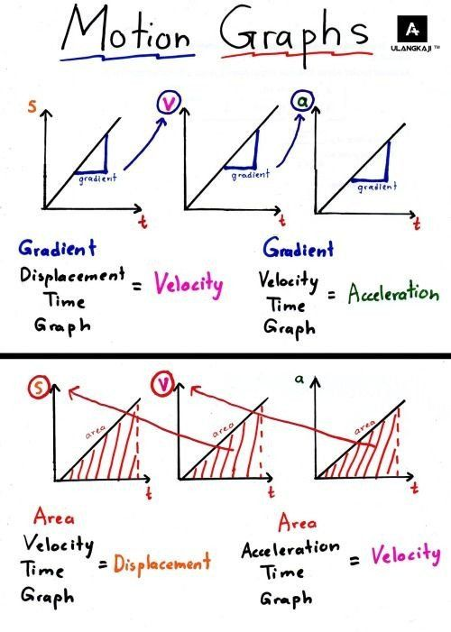

# Mechanics 

## Defections 
Speed is ≡ as Δd&frasl;Δt. Speed is a scale quantity, velocity is a vector quantity.

Acceleration ≡ as Δv&frasl;Δt. Acceleration is the rate of change over time.

## SUVAT 
| Variable | Description | SI unit |
|-----|---|---|
S | displacement | m (metres) |
U |  initial velocity | m/s (metres per second)
V | final velocity | m/s (metres per second)
A | acceleration |9.8 m/s/s (metres per second per second)
T | total time | s (seconds)

v = u + at

s =  (v + u)t&frasl;2

v2 = u 2 + 2as

s = ut + 1&frasl;2 at 2

## Graphs
</img>

## Projectile Motion 