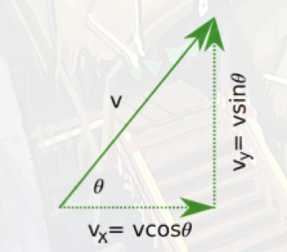

# Mechanics

## Defections

Speed is ≡ as Δd&frasl;Δt. Speed is a scale quantity, velocity is a vector quantity.

Acceleration ≡ as Δv&frasl;Δt. Acceleration is the rate of change over time.

## SUVAT

| Variable | Description      | SI unit                                  |
| -------- | ---------------- | ---------------------------------------- |
| S        | displacement     | m (metres)                               |
| U        | initial velocity | m/s (metres per second)                  |
| V        | final velocity   | m/s (metres per second)                  |
| A        | acceleration     | 9.8 m/s/s (metres per second per second) |
| T        | total time       | s (seconds)                              |

v = u + at

s = (v + u)t&frasl;2

v2 = u 2 + 2as

s = ut + 1&frasl;2 at 2

## Graphs

</img>

## Projectile Motion

</img>
For y axis:

The velocity at any given point will be

vy = -gt + u sin &theta;

Postin for y will be

y = -1&frasl;2gt2 + (u sin &theta;)t

For x axis

Veclocity will be

vx = u cos &theta;

Postion will be

x = ( u cos &theta;)t

### Maximum Height

when vy = 0 or when vy = -gt + u sin &theta; = 0

we get t = u sin &theta;&frasl;g

this can then be insterted into the position function to get

t = u2 sin 2 &theta;&frasl;2g

### Max Range

Due to the sym of motion it will take twice as long to reach the ground as it did to reach max v therefore:

t = 2u sin &theta;&frasl;g

this can be shown in

xrange = u2 sin &theta;&frasl;g

## Newtons Laws in 2d

Every mass exets an attractive force of gravity on every other mass along the line joining their centers

F = G M1 + M2&frasl;r2

### Tension Force 

### Friction Force
